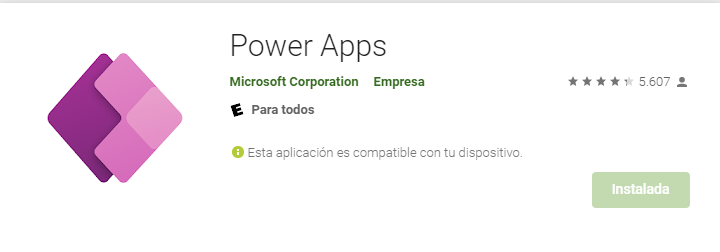

# Power Apps project using Excel tables
By Víctor Suárez Ramos

## Table of Contents
* [1. Introduction](#introducciones)
* [2. Use cases](#useCases)
* [3. Data model](#dataModel)
* [4. Instalation Manual](#instalationManual)
* [5. Technology Stack](#techStack)
* [6. Comparison with other technologies](#comparison)
* [7. References and documentation used](#documentation)

### Use cases<a name="useCases">

### Data Model<a name="dataModel">
The data origin in the app are Excel tables, which makes it a bit more limited, but in turn it becomes easier to understand, as Excel is widely used.
The Excel file has a few tables:  

  *-Administrators:* Contains the emails of the user that are authorized to edit the data source.  
  
  *-Vessels:* Contains the name and types of the different vessels that are subject to operations in the company.  
  
  *-Launching:* Contains all the information of the operation of the same name.  
  
  *-Afloat transfer:* Contains all the information of the operation of the same name.  
  
  *-Tractors:* Contains the different types of tractor used to tow the vessels.  
  

**E-R Diagram:**

**UML Diagram:**

### Instalation Manual<a name="instalationManual">
Installing a Power App is fairly simple, you just have to follow a few easy steps:
  
1. Go to the App Store in your Android Phone and search "Power Apps"

2. Open the app and log in using your organization or educational account, you will have a list of apps that have been shared to you. If you do not see the app you are suposed to have, contact an administrator of your organization.
3. Tap on the app that you need, and you will open it. If the app that you opened has updated since you last opened it, you will have a prompt on the upper portion on your screen that will allow you to update it.

### Documentation<a name="documentation">
[Microsoft Docs](https://docs.microsoft.com/es-es/documentation/)
